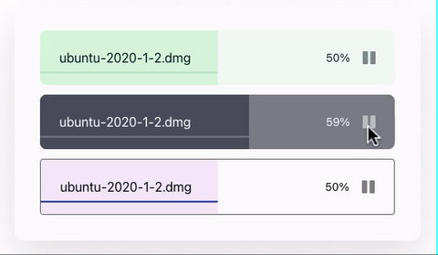

# React Upload Box

<div align="center">
  <div>
    
  </div>
</div>

<h2>Description</h2>

- A minimal upload component built for ReactJS
- Play/Pause feature
- Built with [Typescript](https://www.typescriptlang.org/)
- Styled with [Styled Components](https://www.styled-components.com/)

<h2>Table of Contents</h2>

- [Installation](#-installation)
- [Getting Started](#getting-started)
- [Props](#props)
  - [Default Theme Types](#default-theme-types)
- [Meta](#meta)

## Installation

```sh
  yarn add react-upload-box
```

## Getting Started

> The box covers 100% of the parent `div`. Make sure to wrap it in a component with a flexible width. Otherwise, it "wobbles" as percentage changes.

```javascript

  import React, { useState } from 'react';
  import { ReactUpload } from 'react-placards'
  function App() {
    const [percentage, setPercentage] = useState(0);
    const [pause, setPause] = useState(false);
    const uploadFile = async () => {
      ...
      setPercentage(newPercentage);
    }
    const handlePause = async () => {
      ...
      setPause(true)
    }
    const handleStart = async () => {
        ...
        setPause(false)
    }
    return (
      <div className="App">
        <ReactUpload
          mode="light"
          theme={customTheme} //overrides mode
          fileName={meta.fileName}
          percentage={percentage}
          paused={pause}
          disabled={percentage === 100}
          completed={percentage === 100}
          onPause={handlePause}
          onStart={handleStart}
        />
      </div>
    );
  }
  export default App;

```

## Props

| name         | type                                   | description                                                           | required | default                                           |
| ------------ | -------------------------------------- | --------------------------------------------------------------------- | -------- | ------------------------------------------------- |
| fileName     | `string`                               | file name of the uploading file                                       | true     | `undefined`                                       |
| paused       | `boolean`                              | current pause state of the uploading file                             | true     | `undefined` (falsy)                               |
| percentage   | `number`                               | percentage of file uploaded                                           | true     | `undefined`                                       |
| completed    | `boolean`                              | prop to signal if upload completed (used to apply themes on complete) | false    | false                                             |
| disabled     | `boolean`                              | prop to disable play/pause button (usually after upload finishes)     | false    | false                                             |
| mode         | `light` or `dark`                      | light or dark theme mode (is overriden if `theme` is also supplied)   | false    | 'light' (allowed values: 'light' or 'dark')       |
| onPause      | `() => void`                           | callback fired `onClick` of Pause Button press                        | false    | false                                             |
| onStart      | `() => void`                           | callback fired `onClick` of Play Button press                         | false    | false                                             |
| strokeHeight | `number` or `string`                   | height of the line from base line                                     | false    | `25%`                                             |
| strokeWidth  | `number`                               | width of the line                                                     | false    | 2                                                 |
| theme        | [`DefaultTheme`](#default-theme-types) | custom theme for the component                                        | false    | check [Default Theme Types](#default-theme-types) |

### Default Theme Types

**_box_**, **_overlayColor_**, **_line_**, **_icons_** share the same keys to control colors during different stages:

```javascript
running: 'color when upload is running',
paused: 'color when upload is paused',
completed: 'color when upload is completed',
disabled?: '(applicable to only icon) color when upload is disabled'
```

| key          | description                                       |
| ------------ | ------------------------------------------------- |
| box          | controls color of the container box's background  |
| overlayColor | controls color of overlay's background            |
| line         | controls color of curvy line's stroke             |
| text         | controls color of `percentage` & `fileName` texts |
| icons        | controls color of icons                           |

#### Refer this configuration for more details:

```javascript
lightTheme: DefaultTheme = {
  box: {
    completed: '#b7dabe',
    paused: '#f5f5f5',
    running: '#f1f8f2',
  },
  overlayColor: {
    completed: '#d5f5da'
    paused: '#e6e6e6',
    running: '#d5f5da',
  },
  line: {
    completed: '#b5e2bc'
    paused: '#00171F',
    running: '#b5e2bc',
  },
  text: {
    fileName: '#00171F',
    percentage: '#00171F'
  },
  icons: {
    completed: 'gray',
    disabled: 'gray',
    paused: '#00171f',
    running: '#00171f'
  }
};
```

> To create one's own `theme` copy paste these values and change them accordingly. All keys must be present otherwise the `properties` are set to `none`;

## Meta

Distributed under the MIT license. See `LICENSE` for more information.
